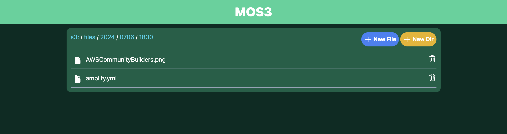

# MOS3 - My Own S3
    
`MOS3` is a mock application for Amazon S3, meaning `My Own S3`, pronounced `mɒsˈθri`.  
  
- Description in English -> [Boost Your Development Efficiency! Simulate S3 with a Custom Amazon S3 Mock Application](https://dev.to/aws-builders/boost-your-development-efficiency-simulate-s3-with-a-custom-amazon-s3-mock-application-19ah)  
- Description in Japanese -> [開発効率UP！Amazon S3のモックアプリを作ってS3をシミュレートする](https://zenn.dev/tttol/articles/13032ef69d8333)
   


# Install
## Docker
Run the following command:
```bash
# https://hub.docker.com/r/tttol/mos3
docker run -p 3333:3333 -v ./upload:/app/upload -it --rm tttol/mos3:latest
```
Then access http://localhost:3333/s3.

> [!NOTE]
> You can replace `./upload` with any path you prefer.

Files uploaded to MOS3 will be saved in `/app/upload`.  
This means that the files and directories in MOS3 will appear in the host machine's path specified with `-v ./upload:/app/upload`.

## Docker Compose
The `compose.yml` file is [here](https://github.com/tttol/mos3/blob/main/compose.yml).

> [!NOTE]
> You can replace `./upload` with any path you prefer.

Run the following command:
```bash
docker compose up -d
```

Then access http://localhost:3333/s3.

# Usage
## Upload file/directory manually
You can upload a file or a directory using the "New File" or "New Dir" button at the top right of the screen.  
Alternatively, you can create them in the directory mounted to `/app/upload` using commands like `touch` or `mkdir`.


## Remove file/directory manually
You can remove a file or directory using trash box icon at the right of each file/directory.
Alternatively, you can use commands like `rm` in the directory mounted to `/app/upload` to delete them.

## Connect your application with MOS3
Here’s how to connect an application that uses Amazon S3 to MOS3.  
By default, MOS3 runs on `localhost:3333`. To access MOS3 from your application, set the S3 endpoint to `http://localhost:3333`.  
Here's an example using the AWS SDK for Java:
```java
S3Client s3 = S3Client.builder()
        .region(region)
        .endpointOverride(new URI("http://localhost:3333"))
        .serviceConfiguration(s3Configuration)
        .build();
```

> [!NOTE]
> ```java
> S3Configuration s3Configuration = S3Configuration.builder()
> .pathStyleAccessEnabled(true) // enable path style access
> .build();
> ```
> When specifying `localhost` as the endpoint, you may need to enable path style access as shown above.

# Contributing guidelines
Thank you for your interest in contributing to our project. Please visit [CONTRIBUTING.md](https://github.com/tttol/mos3/blob/main/CONTRIBUTING.md) for additional information on contributing to this project.

# TBD
- Accept requests from AWS SDK for Java (Priority: High)
  - **DL** 
    - [x] listObjectsV2
    - [x] getObject
  - **Upload**
    - [x] putObject
  - cp
    - [x] copyObject
  - rm
    - [x] deleteObject
- Accept requests from CLI (Priority: Low)
  - [x] ls
  - [x] cp
  - [ ] rm
  - [ ] mv
